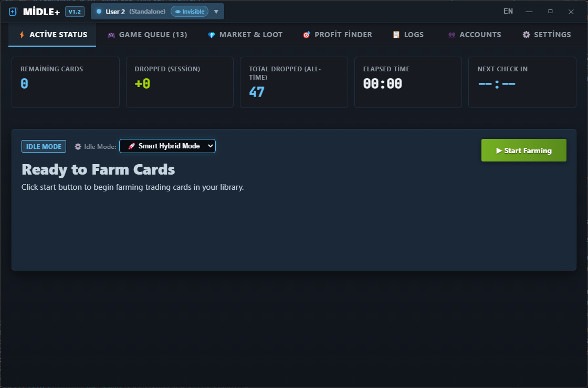
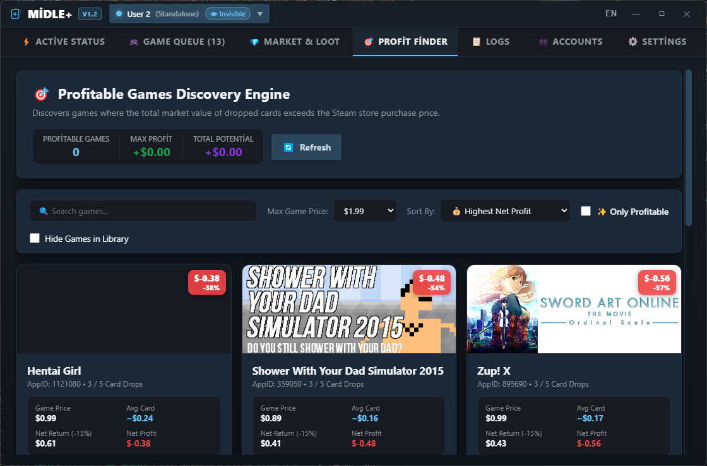
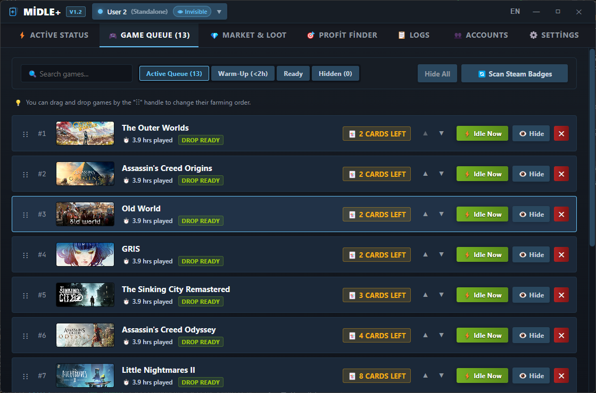
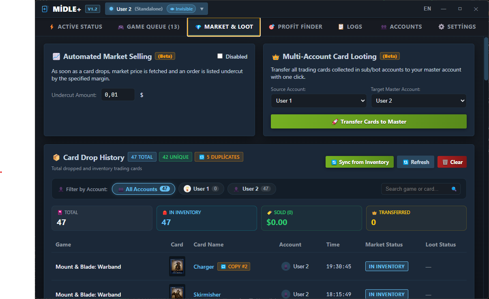
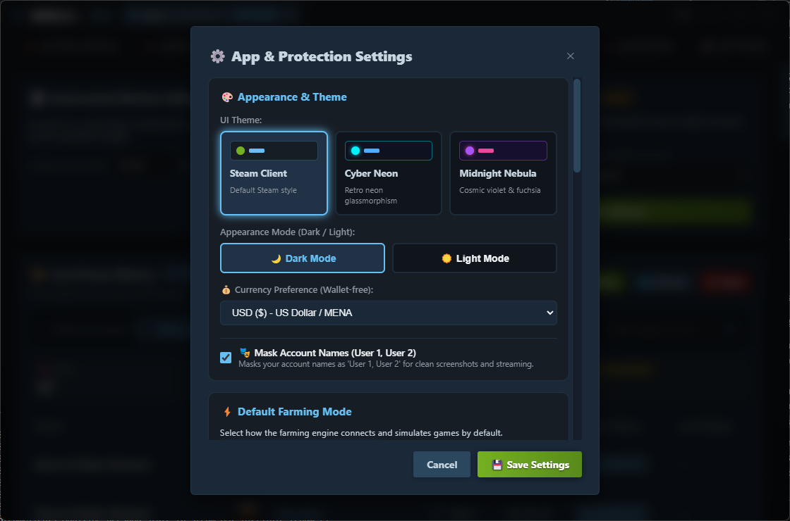

# ⚡ Mega Idle Plus (Midle+) v1.0

<p align="center">
  <strong>Next-Gen Steam Trading Card Farming, Market Automation & Profit Discovery Platform</strong><br />
  <em>Yeni Nesil Steam Kart Düşürme, Pazar Otomasyonu ve Kârlı Oyun Keşif Platformu</em>
</p>

<p align="center">
  <a href="#-english-overview--features">English</a> • <a href="#turkish">Türkçe</a>
</p>

<p align="center">
  
  
  
  
  
</p>

---

## 📸 Screenshots & UI Showcase

<div align="center">

### 🖥️ Main Dashboard & Live Card Farming


### 🎯 Profit Discovery Engine


### 📋 Interactive Games Queue & Prioritization


### 💎 Market Automation & Multi-Account Loot


### 🎨 Themes & Design System


</div>

---

## 📥 Download & Quick Start

Get the latest version of **Mega Idle Plus** for Windows (64-bit):

[-0078D7?style=for-the-badge&logo=windows&logoColor=white)](https://github.com/hsynaktepe/midleplus/releases/latest/download/Mega.Idle.Plus-Setup-1.0.0.exe)
[-28A745?style=for-the-badge&logo=windows&logoColor=white)](https://github.com/hsynaktepe/midleplus/releases/latest/download/Mega.Idle.Plus-Portable-1.0.0.exe)

| Package | Format | Description |
| :--- | :--- | :--- |
| **Windows Installer** | `.exe` (Setup) | Standard installer with automatic shortcuts and uninstaller support. |
| **Windows Portable** | `.exe` (Standalone) | Zero installation required. Plug-and-play directly from a USB drive or desktop. |

> All releases are available on the [GitHub Releases Page](https://github.com/hsynaktepe/midleplus/releases/latest).


## 🌟 English Overview & Features

### 1. ⚡ Smart Card Farming Engine
- **Hybrid Connection Architecture:**
  - **Standalone Mode:** Connects directly to Steam Connection Manager (CM) servers using Steam Mobile QR Authentication without requiring the official Steam desktop client running on your machine.
  - **Local Client Mode:** Operates quietly through your official desktop Steam client using web session cookies—ideal for dual use without credential interference.
- **Intelligent Dual-Phase Strategy:**
  - **Fast Warm-Up (0-2 Hours):** Simulates games under 120 minutes in concurrent batches of up to 32 titles simultaneously to pass the refund drop threshold rapidly.
  - **Smart Solo Drops (2+ Hours):** Simulates eligible games individually to maximize trading card drop frequency from Steam's drop algorithms.
- **Automatic Persona & Privacy Control:**
  - Automatically switches Steam status to **Invisible** or **Silent Online** (with game detail privacy activated), eliminating game activity notification spam to your friends list.
- **Live Reactive Decrementing & Queue Management:**
  - Real-time drop detection automatically decrements remaining card counts (`cardsRemaining`) and removes finished games instantly.
  - When the current game finishes all card drops, the engine automatically advances to the next priority title in the queue.
  - Library badges and remaining card counts are automatically refreshed in the background upon application startup.
- **👥 Multi-Instance Simultaneous Farming:**
  - Run multiple Steam accounts in parallel background sessions simultaneously with isolated queues, independent counters, and dedicated rate-limit guards.

---

### 2. 🎯 Profit Discovery Engine
- **Live Steam Store & Market Arbitrage:** Automatically computes the real-time difference between Steam Store purchase prices and trading card market values.
- **Accurate Net Profit Formula:** Deducts Valve's 15% community market fee ($\text{Net Revenue} = \text{Total Card Value} \times 0.85$) to calculate verified net profit and percentage ROI.
- **Advanced Filtering & Quick Buy:**
  - "Hide Games in Library" toggle to exclude already-owned titles.
  - Budget ceiling filters ($0.99, $1.99, $2.99, $5.00, All).
  - Sort by Net Profit, Profit %, or Game Price.
  - Direct 1-click button to open the Steam Store page in browser.
- **Dual Light & Dark Theme Support:** Fully styled with adaptive color tokens and contrasting badges for both Dark and Light modes.

---

### 3. 💎 Market Automation & Multi-Account Loot
- **📈 Automated Market Listing (Beta):**
  - As soon as a card drops, queries the current lowest market price and automatically lists the card on the Steam Community Market with a customizable undercut margin.
- **👑 One-Click Multi-Account Card Looting (Beta):**
  - Consolidates all collected trading cards from alt/bot accounts to your master account with a single click via automated trade offers.
- **Inventory Synchronization & Deduplication:**
  - Scans Steam inventories with duplicate protection and memory caching to repair generic names and eliminate duplicate drop records.

---

### 4. 🛡️ Security Shield & Rate-Limit Optimization
- **VAC Protection Guard:** Automatically inspects Valve Anti-Cheat flags and filters out protected games (CS2, TF2, Rust, Dota 2, etc.).
- **Auto-Pause on Gaming:** Continuously monitors Windows processes. If you launch a real Steam game, card simulation pauses instantly and resumes safely after you finish playing.
- **Request Rate-Limit Shield (HTTP 429 Guard):**
  - **In-Flight Request Deduplication:** Merges simultaneous requests for the same account into a single Promise.
  - **TTL Memory Caching:** 30-second cache for inventory calls and 5-minute cache for market priceoverview queries.
  - **Event Debouncing:** Consolidates rapid Steam `newItems` notifications (3000ms debounce) into a single optimized query.
- **Windows DPAPI Vault:** Credentials, cookies, and tokens are encrypted locally with Windows `safeStorage` (DPAPI) and AES-256-GCM.

---

### 5. 🎨 Design Aesthetics & Localization
- **Curated Themes:** Steam Client Classic, Cyber Neon Glass, and Midnight Purple.
- **Complete Light Mode:** Clean, high-contrast light theme with zero dark-mode artifacts or hardcoded colors.
- **Wallet-Free Multi-Currency:** Auto-detects account store country (USD $, TRY ₺, EUR €, GBP £, etc.) without querying wallet balances, plus manual currency overrides in Settings.
- **100% Dual-Language:** Complete Turkish and English support across all UI elements, system alerts, and logging messages.

---

## 🛠️ Installation & Building (English)

### Development Setup
```bash
# 1. Install dependencies
npm install

# 2. Run in live development mode (Vite + Electron)
npm run dev
```

### Production Build (.exe Installer & Portable)
```bash
# Packages Windows installer and portable standalone executable into dist/
npm run package
```
> Place your custom 256x256 icon at `build/icon.ico` prior to packaging for branded application icons.

---

## 📂 Architecture Map

```text
idleplus/
├── docs/                           # Application UI Screenshots & Media
├── src/
│   ├── main/                       # Electron Main Process (Node.js & Backend)
│   │   ├── services/
│   │   │   ├── database.ts         # SQLite & Resilient Fallback Engine
│   │   │   ├── crypto.ts           # Windows DPAPI & AES-256-GCM Vault
│   │   │   ├── steamClient.ts      # Steam CM, Mobile Auth & Community Wrapper
│   │   │   ├── farmingEngine.ts    # Multi-Instance Orchestrator & Live Queue Manager
│   │   │   ├── marketService.ts    # Steam Market Pricing with 5-min TTL Cache
│   │   │   ├── profitService.ts    # Profitable Games Engine (1h Store Cache)
│   │   │   ├── lootService.ts      # Automated Multi-Account Trade Transfer
│   │   │   ├── protectionService.ts# VAC & In-Game Detection Process Monitor
│   │   │   └── adaptivePoller.ts   # 429-Protected Adaptive Poller
│   │   └── index.ts                # IPC Bridges & Window Lifecycle
│   │
│   ├── renderer/                   # React 18 + TypeScript + Vite UI
│   │   ├── src/
│   │   │   ├── components/
│   │   │   │   ├── ActiveFarming.tsx   # Live Simulation, Counters & Progress
│   │   │   │   ├── GamesQueue.tsx      # Drag-and-Drop Interactive Queue
│   │   │   │   ├── ProfitFinderTab.tsx # Profitable Games Arbitrage Tab
│   │   │   │   ├── MarketLootTab.tsx   # Auto-Sell & Multi-Account Loot
│   │   │   │   ├── AccountsModal.tsx   # QR Auth & Account Mode Switcher
│   │   │   │   ├── SettingsModal.tsx   # Multi-Instance, Security & Preferences
│   │   │   │   ├── Header.tsx          # Steam Titlebar & Mode Indicators
│   │   │   │   └── LogsPanel.tsx       # Live System Diagnostic Logs
│   │   │   ├── locales/            # en.json & tr.json Language Bundles
│   │   │   └── index.css           # Modern Design Tokens, Themes & Light Mode
│   │   └── index.html              # Secure CSP Container
│   └── shared/
│       └── types.ts                # Shared TypeScript Data Contracts
├── build/
│   └── README.md                   # icon.ico Packaging Guide
├── package.json
└── README.md
```

---

## ⚖️ Disclaimer (English)
This software is developed for personal automation, educational, and research purposes. **Mega Idle Plus** is not affiliated with, authorized, or endorsed by Valve Corporation or Steam. Steam is a registered trademark of Valve Corporation.

<br />

================================================================================

<br />
<a id="turkish"></a>
# ⚡ Mega Idle Plus (Midle+) v1.0 — Türkçe

---
## 📥 İndirme ve Hızlı Başlangıç

Windows (64-bit) için **Mega Idle Plus**'ın en güncel sürümünü hemen indirin:

[-0078D7?style=for-the-badge&logo=windows&logoColor=white)](https://github.com/hsynaktepe/midleplus/releases/latest/download/Mega.Idle.Plus-Setup-1.0.0.exe)
[-28A745?style=for-the-badge&logo=windows&logoColor=white)](https://github.com/hsynaktepe/midleplus/releases/latest/download/Mega.Idle.Plus-Portable-1.0.0.exe)

| Paket Türü | Format | Açıklama |
| :--- | :--- | :--- |
| **Windows Kurulum Sihirbazı** | `.exe` (Setup) | Masaüstü kısayolları ve Denetim Masası kaldırma desteği olan standart kurulum. |
| **Taşınabilir (Portable)** | `.exe` (Bağımsız) | Kurulum gerektirmez. İndirip doğrudan flash bellekten veya klasörden çalıştırın. |

> Tüm geçmiş ve güncel sürümler için [GitHub Sürümler Sayfası](https://github.com/hsynaktepe/midleplus/releases/latest)'nı ziyaret edebilirsiniz.


## 🌟 Türkçe Genel Bakış & Özellikler

### 1. ⚡ Akıllı Kart Düşürme Motoru (Smart Farming Engine)
- **Hibrit Çalışma Mimarisi:**
  - **Bağımsız Mod (Standalone):** Bilgisayarınızda resmi Steam istemcisi açık olmadan, Steam Mobile QR kodu ile doğrudan Steam sunucularına bağlanır.
  - **Yerel İstemci Modu (Local Client):** Açık olan resmi Steam istemcinizle çakışmadan, tarayıcı çerezleri üzerinden sessiz ve hafif modda çalışır. İki mod arasında dilediğiniz an tek tıkla geçiş yapabilirsiniz.
- **Akıllı Çift Fazlı Strateji:**
  - **Hızlı Ön Isınma (0-2 Saat):** 2 saatin altındaki oyunları 32'şerli paketler halinde eşzamanlı çalıştırarak kart düşürme eşiğine dakikalar içinde ulaştırır.
  - **Akıllı Solo Düşürme (2+ Saat):** 2 saati dolduran oyunları tek tek sırayla simüle ederek kart düşme olasılığını en üst düzeye çıkarır.
- **Görünmezlik & Bildirim Koruması (Invisible Persona):**
  - Kart düşürme esnasında Steam durumunuzu otomatik olarak **Görünmez (Invisible)** veya **Gizli Çevrimiçi (Silent Online)** yapar; arkadaş listenize oyun bildirim spami gitmez.
- **Dinamik Kalan Kart Takibi ve Canlı Kuyruk:**
  - Kart düştüğünde arayüzdeki kalan kart sayısı anında azalır; kartları tükenen oyunlar otomatik olarak kuyruktan kaldırılır ve sıradaki oyuna geçilir.
  - Uygulama her açıldığında aktif hesabın kütüphanesi arka planda taranarak kalan kart sayıları otomatik olarak güncellenir.
- **👥 Çoklu Hesap Eşzamanlı Farm (Multi-Instance):**
  - Birden fazla Steam hesabını tek bir ekranda, birbirini beklemeden arka planda paralel olarak çalıştırabilirsiniz.

---

### 2. 🎯 Kârlı Kart Oyunları Keşif Motoru (Profit Discovery Engine)
- **Canlı Pazar & Mağaza Karşılaştırması:** Düşecek koleksiyon kartlarının pazar satış değeri ile oyunun Steam mağaza fiyatını anlık olarak kıyaslar.
- **Doğrulanmış Net Kâr Formülü:** Valve'ın %15 pazar kesintisini otomatik düşerek ($\text{Net Gelir} = \text{Toplam Değer} \times 0.85$) gerçek net kârı ve getiri yüzdesini hesaplar.
- **Gelişmiş Filtreleme:**
  - "Kütüphanemde Olanları Gizle" seçeneği.
  - Maksimum bütçe tavanı filtreleri ($0.99, $1.99, $2.99, $5.00, Tümü).
  - Net Kâr, Getiri Oranı ve Oyun Fiyatına göre anında sıralama.
  - Tek tıkla doğrudan Steam Mağaza sayfasını tarayıcıda açma.
- **Tam Aydınlık (Light) ve Koyu (Dark) Mod Uyumu:** Açık temada göz yormayan, net okunabilir kart tasarımları.

---

### 3. 💎 Pazar Otomasyonu & Çoklu Hesap Aktarımı
- **📈 Otomatik Pazar Satışı (Beta):**
  - Kart düştüğü anda güncel pazar fiyatını sorgular ve belirlediğiniz fiyat kırma marjıyla (undercut) anında pazara satış emri koyar.
- **👑 Çoklu Hesap Kart Aktarımı (Loot) (Beta):**
  - Yan veya bot hesaplarda biriken tüm kartları tek tıkla ana hesabınıza takasla gönderir.
- **Envanter Eşitleme & Çift Kayıt Temizliği:**
  - Steam envanterini tarayarak gerçek kart görsellerini ve isimlerini senkronize eder; yinelenen kayıtları temizler.

---

### 4. 🛡️ Güvenlik Kalkanı & Ağ İstek Optimizasyonu
- **VAC Koruması:** VAC korumalı oyunlar (CS2, TF2, Rust, Dota 2 vb.) otomatik algılanır ve kuyruktan elenir.
- **Oyun İçi Algılama (Auto-Pause):** Bilgisayarınızda gerçek bir Steam oyunu başlattığınızda kart düşürme otomatik duraklar; oyunu kapattığınızda güvenle devam eder.
- **Ağ & Hız Sınırı Koruma Kalkanı (HTTP 429 Shield):**
  - **İstek Birleştirme (In-Flight Deduplication):** Aynı hesaba giden eşzamanlı istekler tek bir sorguda birleştirilir.
  - **Önbellek (TTL Caching):** Envanter için 30 saniye, pazar fiyatları için 5 dakika önbellek uygulanarak Steam rate-limit engelleri aşılır.
  - **Bildirim Debounce (3000ms):** Art arda gelen bildirimler süzülerek tek bir optimize istek haline getirilir.
- **Windows DPAPI Şifreleme:** Oturum çerezleri ve token'lar veritabanında asla açık metin olarak tutulmaz; Windows `safeStorage` ve AES-256-GCM ile şifrelenir.

---

### 5. 🎨 Temalar ve Tasarım Mimarisi
- **Temalar:** Steam Client Classic, Cyber Neon Glass, Midnight Purple.
- **Aydınlık Mod (Light Mode):** Karartılmış kutular barındırmayan, tertemiz ve profesyonel açık tema desteği.
- **Cüzdansız Çoklu Para Birimi:** Kullanıcı cüzdanını sorgulamadan mağaza ülkesine göre USD ($), TRY (₺), EUR (€), GBP (£) gibi para birimlerini otomatik tespit eder veya Ayarlar üzerinden seçim imkânı sunar.
- **%100 Çift Dil:** Türkçe ve İngilizce tam yerelleştirme.

---

## 🛠️ Kurulum ve Çalıştırma (Türkçe)

### Geliştirici Ortamı (Development)
```bash
# 1. Bağımlılıkları yükleyin
npm install

# 2. Geliştirme modunda (Vite + Electron) başlatın
npm run dev
```

### Kurulum Paketi Üretme (Production Build)
```bash
# Windows x64 kurulum paketi (NSIS Installer & Portable EXE) üretmek için:
npm run package
```
> Kurulum dosyasında kendi logonuzun görünmesi için oluşturduğunuz ikonu `build/icon.ico` yoluna yerleştirin.

---

## ⚖️ Sorumluluk Reddi (Türkçe)
Bu uygulama kişisel otomasyon, eğitim ve araştırma amaçlı geliştirilmiştir. **Mega Idle Plus**, Valve Corporation veya Steam ile doğrudan ilişkili, yetkili veya onaylanmış bir yazılım değildir. Steam, Valve Corporation'ın tescilli ticari markasıdır.
